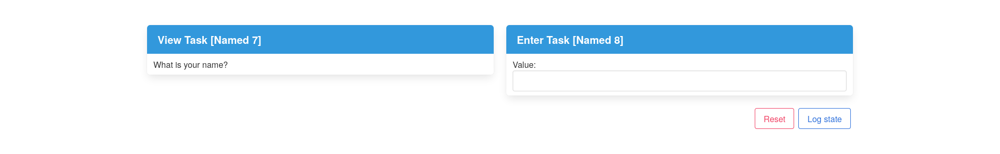

# Installation & Usage

## Installation

The project is currently untested as a library, however it *should* just work.
Keep in mind that TopHat uses a custom Prelude, so you will have to use a mixin
or some other solution.

## Usage

The library exposes a single function: `visualizeTask`. The library will spin up
a web server to visualize the passed task. By default, the application can be
accessed at [http://localhost:3000](http://localhost:3000). The port number can
be changed by passing it as an environment variable, e.g.:

```console
$ PORT=3001 stack run
```

Consider the following example:

```
{-# LANGUAGE OverloadedStrings #-}

import Task (Task, enter, view, (>>?))
import Visualize (visualizeTask)

main :: IO ()
main = visualizeTask greet

greet :: Task h Text
greet =
  (question >< promptName)
    >>? \(_, name) -> view ("Hello, " <> name)
  where
    question :: Task h Text
    question = view "What is your name?"

    promptName :: Task h Text
    promptName = enter
```

This will produce the following application when run:



Take a look at the `app` directory for some more examples. To run a specific
example:

```$console
$ stack runghc app/TemperatureCalculator.hs
```
